# The Crossing — Brand Guidelines

Human- and agent-readable guidance for using The Crossing's brand. For structured data (exact colors, logo paths, variants), see [`brand-kit.json`](brand-kit.json). For the full printed reference, see the official **Brand Guides 2023** (internal).

> **Note:** color values below come from the official **Brand Guides 2023**. CMYK/Pantone equivalents still need to be added for print work.

## Who we are

The Crossing is a four-campus evangelical Christian church near St. Louis, MO — Chesterfield (CFD), Fenton (FEN), Grant's Trail (GRT), and Mid Rivers (MID). Our mission is to help people become fully devoted disciples of Christ by creating opportunities to **explore truth, experience grace, and express love**.

## Voice

Grace-first, Christ-centered, warm, and accessible to both long-time members and first-time guests. Echo the mission language. Avoid theological jargon a newcomer wouldn't understand. Default to plain, direct language.

Our four **pulse words** capture the feel: **Tangible**, **Warmth**, **Ancient / Future**, and **Artistic** — real and present, welcoming, holding the historic and the forward-looking together, with room for beauty.

## Logo

The master logo pairs an interlocking-rings **icon** with the **wordmark**. The **stacked** version (icon on top of the words) is the **primary** logo — use it unless it won't fit, in which case use the horizontal version. Variants: stacked, horizontal, horizontal-with-URL, and icon-only.

**Three approved colorways** — nothing else:

| Colorway | Color | Use on |
|---|---|---|
| **Limed Spruce** (primary) | Crossing Blue `#425964` | white & light backgrounds |
| **Armadillo** (alternate) | `#3C3A36` | white & very light backgrounds |
| **Pure White** | `#FFFFFF` | medium-to-dark backgrounds (often photos) |

These three govern the **master logo only**. KidsCrossing and Youth Crossing have their own colorways — see [Sub-brands](#sub-brands).

**Clear space.** Give the logo generous surrounding space so it feels special and stands out. Don't size it to fill all the available room.

### The five don'ts

1. Don't change the relationship (size or position) between the icon and the text.
2. Don't change the font of the wordmark.
3. Don't add text inside the logo's recommended clear-space margin.
4. Don't stretch or squash the logo.
5. Don't set the logo in a color that isn't recommended (Limed Spruce, Armadillo, or Pure White only).

### See it

Worked examples live in [`samples/logo-usage/`](samples/logo-usage/) — self-contained SVGs you can
drop into a deck or an email when someone needs showing rather than telling.

**Do**

| | |
|---|---|
| 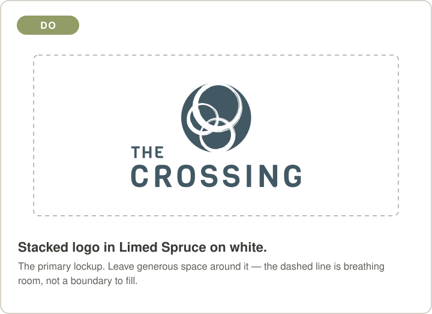 | 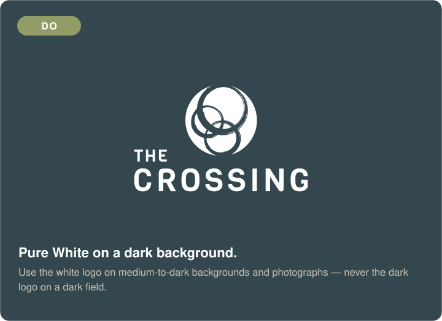 |
| 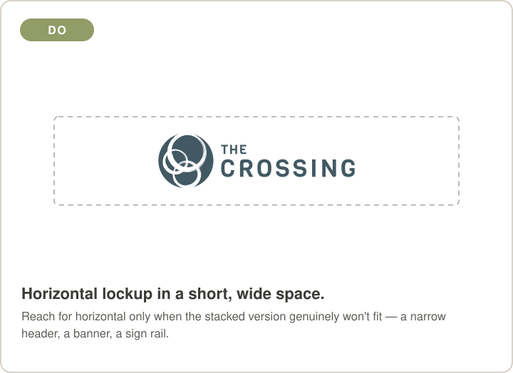 | |

**Don't** — one example per rule above

| | |
|---|---|
| 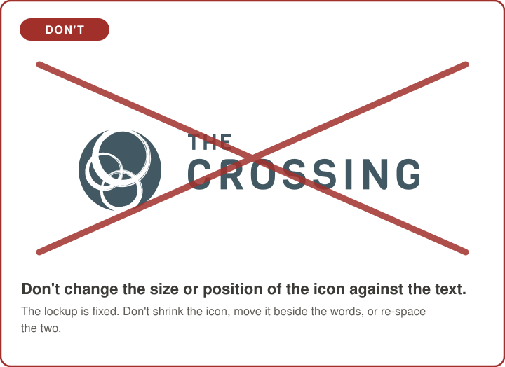 | 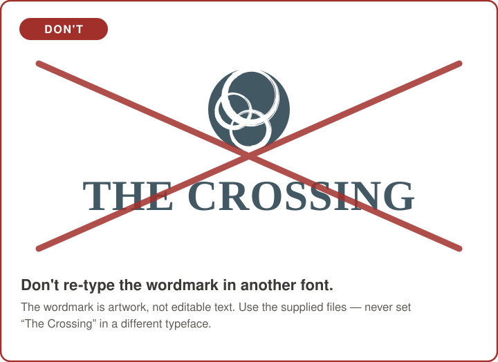 |
| 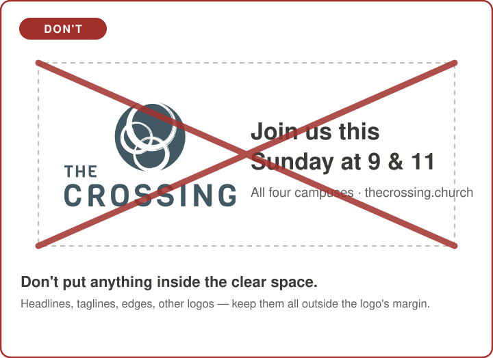 | 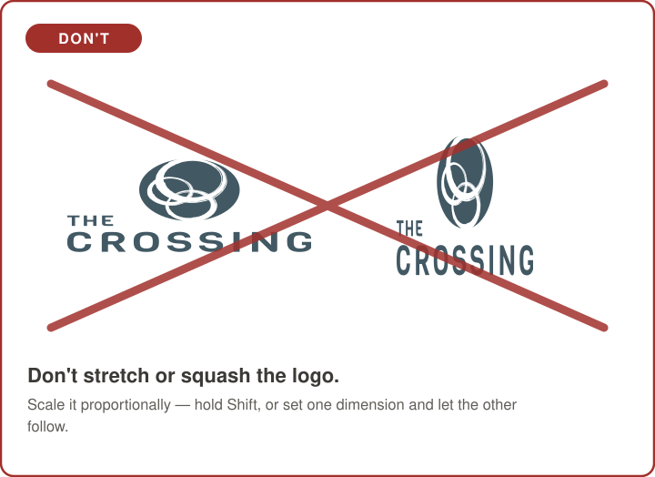 |
| 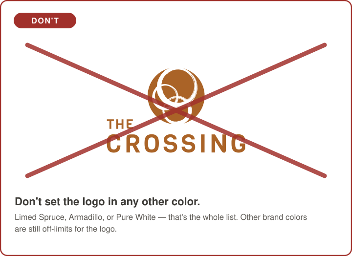 | |

## Color

The Crossing uses a broad, earthy palette. **Primary** colors are the brand identifiers and set the tone; **secondary** colors add contrast and emphasis; **neutrals** ground everything. Exact hex values for all 24 named colors are in [`brand-kit.json`](brand-kit.json) and [`colors/`](colors/).

**Primary:** Crossing Blue `#425964` · FTL Ice Blue `#BFD9DA` · Dark Plum `#5F4750` · Light Forest `#919C67` · Quincy `#754230` · Burnt Orange `#AA6327` · Corduroy `#61736E` · Dark Spruce `#34474E`

**Secondary:** Forest Green · Bright Teal · Light Yellow · Light Green · Lifeblood · Golden Yellow · Nevada · Dust · Dark Brown · Mule Brown

**Neutral:** Armadillo · Stone Path · Overcast · Ash · Bison Hide · White

CMYK and Pantone values for print should be added to `brand-kit.json` from Brand Guides 2023.

## Typography

The Crossing uses distinct typefaces by role. **Bariol is the body font — not the wordmark** (the logo is set in Viga).

| Role | Typeface |
|---|---|
| Display / headlines | **Bastia** (Bold + Outline) |
| Secondary headings | **Neue Einstellung** |
| Logo / wordmark | **Viga** (open source — Google Fonts) |
| Body copy | **Bariol** (Regular · Bold · Italic · Bold Italic) |
| Alt body | **Bastia** |
| Script accent | **Hey August** (sparingly) |

**Licensing.** **Bariol** (atipo foundry) is commercial — The Crossing holds Desktop, Webfont, and App/OTT licenses. Keep the desktop `.otf` files in the private repo for staff install; do **not** commit them to this public repo. On the web, serve the licensed `.woff2` from the webfont package (don't convert the desktop `.otf`). **Bastia**, **Neue Einstellung**, and **Hey August** are also commercial — confirm each one's web-embedding rights before using it on the site. **Viga** is open-licensed (SIL OFL) and free to embed. Where a licensed face can't be embedded, fall back to **Nunito Sans** / the system sans-serif stack in `brand-kit.json`.

## Sub-brands

Each ministry has its own mark — not a restyled Crossing logo.

| | KidsCrossing (KC) | Youth Crossing (YC) |
|---|---|---|
| | 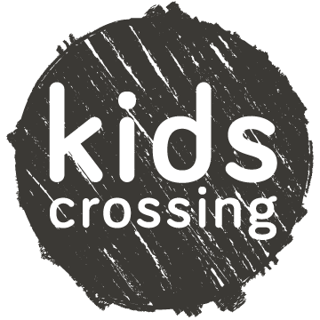 | 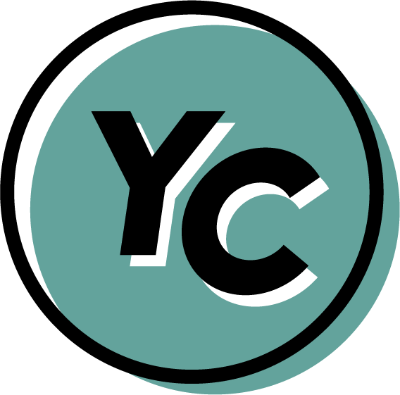 |
| **Ministry** | Children's ministry | Student ministry |
| **Mark** | Textured circle with the words *kids crossing* | Offset circle with "YC" |
| **Colorways** | charcoal · blue · white · black | teal · light teal · cream · yellow · black · white · yellow-on-white |
| **Texture** | Grain is part of the mark | Most colorways come with **and** without grain |

**KidsCrossing colorways**

 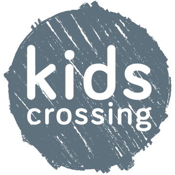

*(A white version, `kc-circle-white.png`, is for dark backgrounds — it's invisible here on white.)*

**Youth Crossing colorways** (no-grain versions shown)

 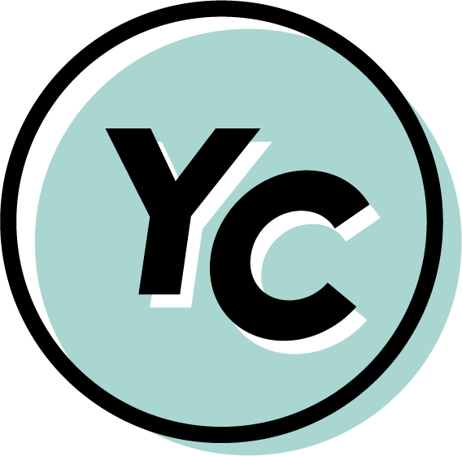  

Sub-brands keep their own colorways; don't recolor them into the main Crossing palette or vice-versa.
The five logo don'ts above apply to these marks too.

**File-size note.** The grain PNGs are 7–8 MB. For anything on screen — web, slides, email — use the
`*-no-grain.png` or the SVG. Save the grain versions for print.

## Getting assets

Download from [brand.thecrossing.church](https://brand.thecrossing.church), or pull any file by raw URL:
`https://raw.githubusercontent.com/TheCrossing-Church/brand/main/<path>` (see [`README.md`](README.md)).

## Using AI with the brand

Point AI tools at `brand-kit.json` + this file so they produce on-brand work. Always review AI-generated, member-facing material before publishing, and use only church-approved AI tools — per our organization's AI-use guidelines. For pastoral, doctrinal, or care topics, defer to a pastor or the care team, not AI.

## Questions / changes

The brand repo is owned by the Rock team (`@TheCrossing-Church/rock-team`). To change something, commit it to `main` in [`TheCrossing-Church/brand`](https://github.com/TheCrossing-Church/brand) — or open an issue there if you'd rather someone else make the change.
